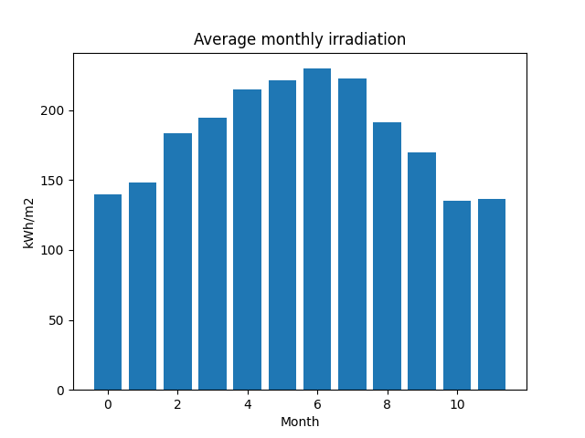
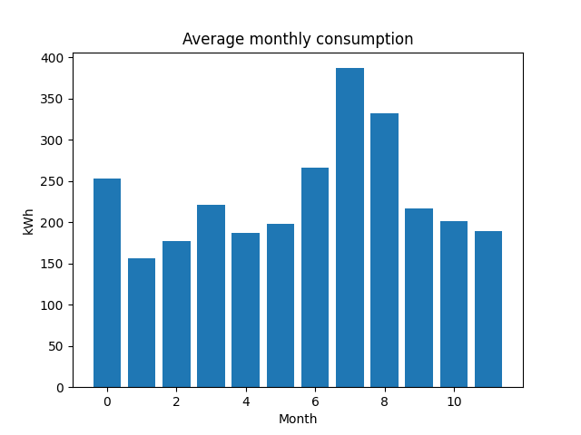

# Solar-Panel-Estimation

[](https://www.python.org/downloads/release/python-3102/)


<p align = "center">
<a href="https://www.flaticon.es/iconos-gratis/panel-solar"></a>
</p>


With this simple code it is possible to estimate how many photovoltaic solar panels are needed for a house.

This requires some input data which, in this case, are all within the code, except for the city which must be entered by keyboard.

## Introduction

With this code you can get an approximate idea of how many photovoltaic solar panels are needed for an installation with known or estimated monthly consumption. For this purpose, the free [PVGIS](https://re.jrc.ec.europa.eu/pvg_tools/en/) API of the Join Reseacrh Center is used to get the monthly irradiation data for the place indicated by keyboard. You can get more information about this API [here](https://joint-research-centre.ec.europa.eu/pvgis-photovoltaic-geographical-information-system/getting-started-pvgis/api-non-interactive-service_en)

This tool is very useful and has many more possibilities of use than the one shown here.

## Data needed for the request

In this case, calculations have been made with monthly irradiation data for a time period from 2005 to 2020 (maximum range of the database consulted). In addition, the optimal angle for a balanced consumption throughout the year has also been introduced, so the data that we have to enter in the code is these:

```python
    vers='v5_2'
    tool_name='MRcalc'
    data_base = 'PVGIS-SARAH2'
    start_year = '2005'
    end_year = '2020'
    isang = '1'
        
```
- **vers** indicates the version of PVGIS, which in this case is the most current one.
- **tool name** refers to the name of the tool within PVGIS that we are going to access.
- **data_base** is the chosen database. I have chosen this one because it had records more years. Depending on the search area the databases can change, an option if you are not clear about this is to remove this parameter since the API takes by default a database depending on the location. If we do this we have to make sure that this database has records from the indicated years. The default DBs are PVGIS-SARAH, PVGIS-NSRDB and PVGIS-ERA5 based on the chosen location.
- **isang** indicates that we are going to pass the optimal angle to the request.

Besides this we have to define the most important variables: **Latitude**, **Longitude** and **Tilt angle**.

To choose the optimal angle there are several ways to define it depending on our interests, if we want to focus on production in summer, winter or throughout the year. 

In this case and without going into details, we are going to prioritize the annual consumption where we could take the latitude of the place as the optimal angle, however, we are going to use the following expression:
```python
  angle = 3.7 + 0.69 * float(lat)

```
Before this, we get the latitude and longitude through the Nominatim [API](https://nominatim.org/release-docs/latest/api/Search/) as we have already seen in the [Weather-Python](https://github.com/FranGarcia94/Weather-Python) repository.

## Data needed for calculation.

There are three parameters that are necessary for the calculation: **performance**, **monthly_consumption** and **module_power**.

- **performance** is a performance value of the installation, it is lower than normal because, as already mentioned, this calculation is preliminary and indicative and we do not take into account all possible factors.

- **monthly consumption** is the average monthly consumption of the user. In this case, these consumptions belong to a house in the south of Spain for which monthly records have been kept for the last 3 years. The consumption data can be obtained from the electricity bill or by visiting the customer area of your supplier. You can also estimate monthly consumption through the power of your electrical appliances.

- **module_power** corresponds to the power of a generic module, in this case a 400 W module has been assumed.

## Results

Enter a City: Almería
|                                      |    Jan |    Feb |    Mar |    Apr |    May |    Jun |    Jul |    Aug |    Sep |    Oct |    Nov |    Dec |
|--------------------------------------|--------|--------|--------|--------|--------|--------|--------|--------|--------|--------|--------|--------|
| Average monthly irradiation [kWh/m2] | 139.94 | 148.49 | 183.66 | 194.81 | 214.98 | 220.92 | 229.59 | 222.68 | 191.5  | 169.73 | 135.31 | 136.57 |
| Average monthly consumption [kWh]    | 252.67 | 156.67 | 177.33 | 221.33 | 187.67 | 197.89 | 266.5  | 387    | 332.67 | 216.33 | 201    | 189.33 |

Number of 400.0 W modules required: 8

 

## Conclusion

This code does not carry out a detailed study of the user's needs nor does it propose a viable solution, but rather, it makes a simple estimate of the solar capacity necessary to satisfy their needs, to see graphically what the consumption trend is and the irradiation that reaches their area.

For an in-depth study, it is necessary to take into account important factors such as: Forecast increase in demand, what the self-consumption is aimed at, use of batteries, connection to the grid, annual or weekend use, etc.

Other factors such as the number and capacity of batteries, series/parallel connection of panels, inverter or charge regulator should also be taken into account.

